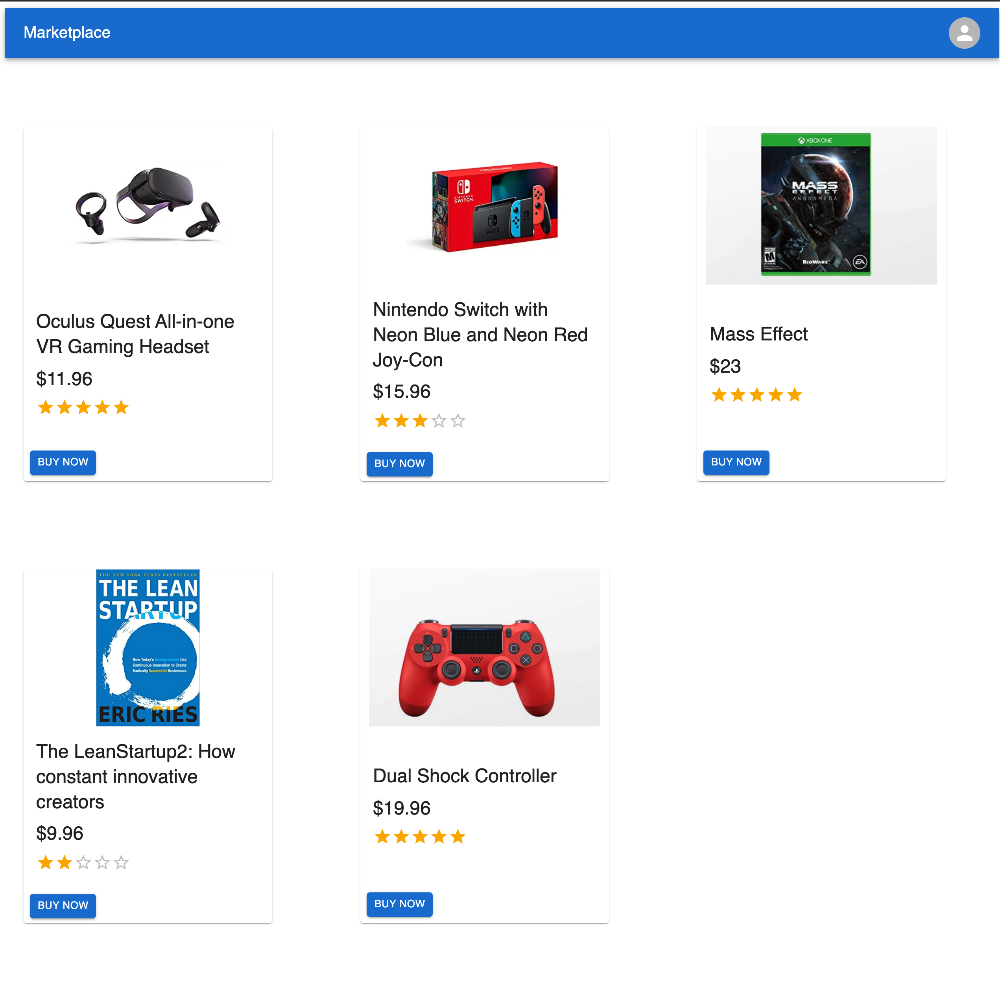
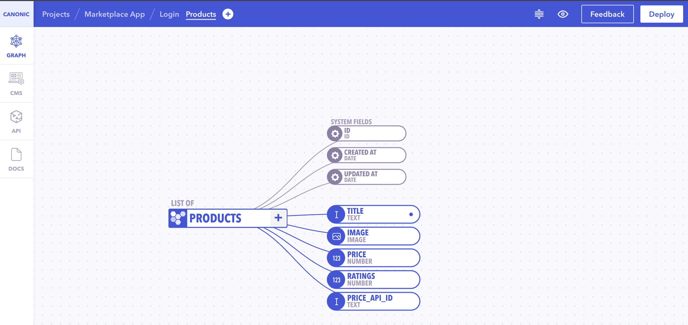
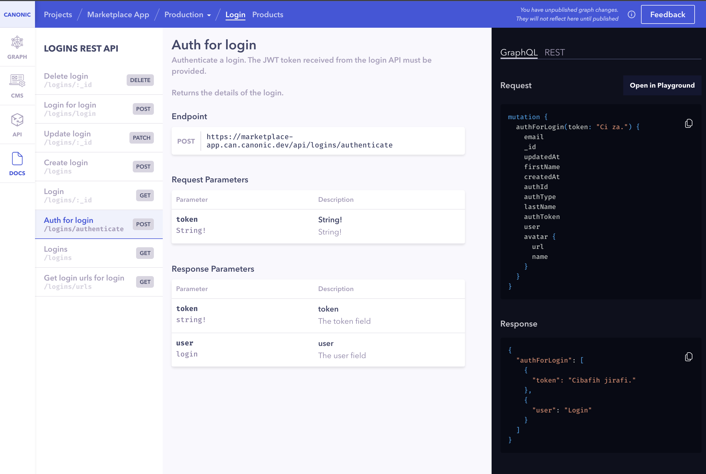

# Marketplace App

The app is a demo of how you can build a Marketplace App using React, Material UI, GraphqQL and [Canonic](https://canonic.dev/) as the **Backend**



**Authentication and Products data is handled by your Canonic project.**

## Links

### [Demo](https://canonic-marketplace.netlify.app/)

### [Tutorial](https://dev.to/canonic/build-marketplace-app-with-stripe-billing-3j8)

## Running the example

### Frontend

The frontend is a simple create-react-app. After cloning, install the dependencies.

```
yarn install
```

Then start the dev server

```
yarn start
```

### Backend

You can find the sample backend project **Github PR Dashboard** [here](https://app.canonic.dev/projects/61bf5c65590bbb002e8a9dc3/) and clone it.



Copy the base url from the docs



Change the value of URI in [index.js](./src/index.js)

The example should now fetch data from the project you deployed.
