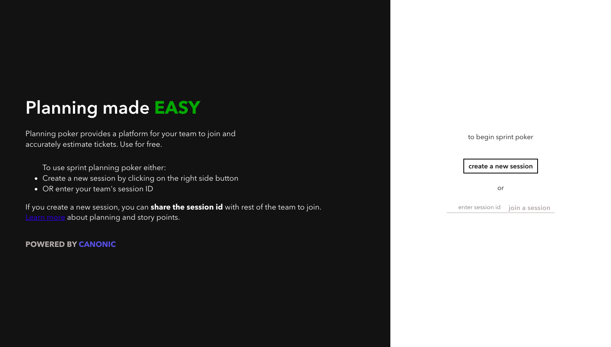
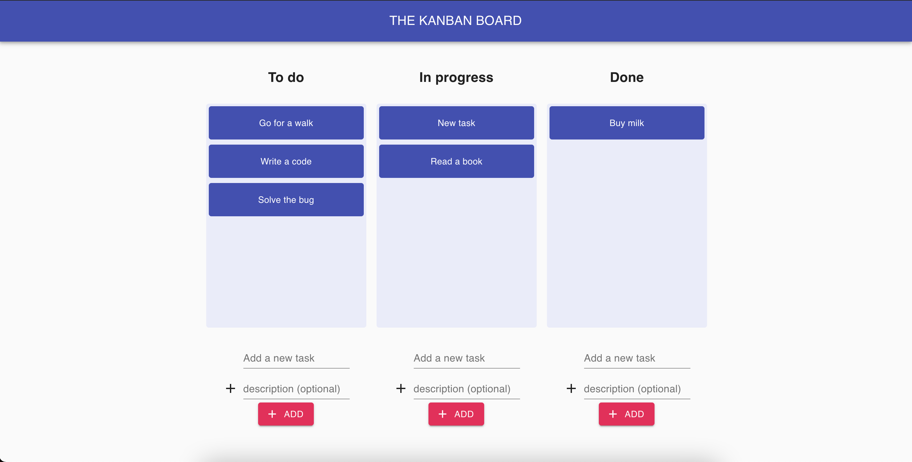
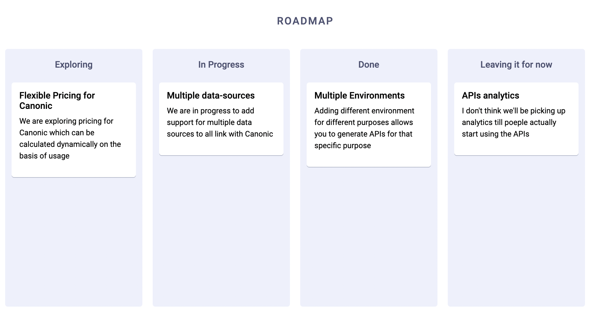

# Samples built on Canonic

This repository contains code samples for different types of applications using different languages and frameworks. 
**The applications are powered by APIs built using [Canonic's](https://canonic.dev) platform.**

## Projects

### 🍿 [Movie Hunt](./moviehunt-web/)

Similar to Product Hunt but for movies. It's a dynamic web application based on Gatsby

---

 

### 🍻 [Canolo](./Canolo-iOS/)

Sample iOS Application built with Swift for getting a party started.

---

 

### 🔐 [Google Signin with React using Graphql](./google-signin-with-react/)

Sample web app built using React, demonstrating how google signin works with Canonic via graphql APIs

---

 

### 🃏 [React Webapp for pointing poker](./sprint-poker/)

ReactJS webpack integrated with Canonic using APIs for pointing poker to help you decide story points to JIRA tickets

---

 

### [Kanban Board a react app](./kanban-board/)

Sample kanban board web app created using React,apollo and graphql.

---

 

### [Roadmap](./roadmap/)

Roadmap app created with React, GraphQL and Canonic as a backend.

---

 

#### More coming soon 🚀

#### Join the thriving 🌎 [Discord](https://discord.gg/9dyytsM) community to get help and share and brainstorm ideas.
