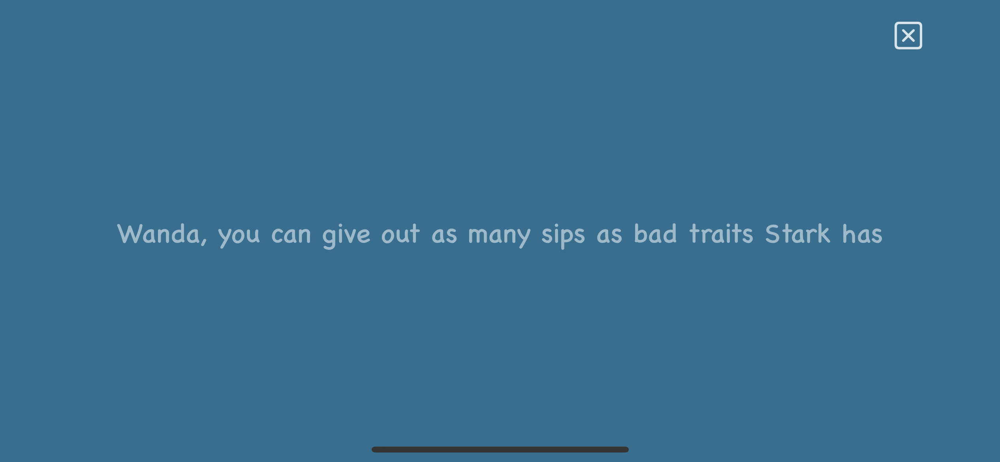

# Samples built on Canonic

This repository contains code samples for different types of applications using different languages and frameworks.

 

**The applications are powered by APIs built using [Canonic's](https://canonic.dev) platform.**

## Projects

### 🍿 [Movie Hunt](./moviehunt-web/)

Similar to Product Hunt but for movies. It's a dynamic web application based on Gatsby

---

 

### 🍻 [Canolo](./Canonic-iOS)

Sample iOS Application built with Swift for getting a party started.

> ### More coming soon 🚀
