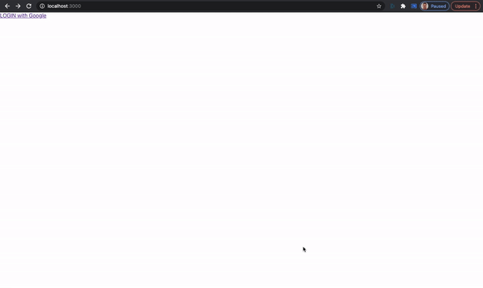
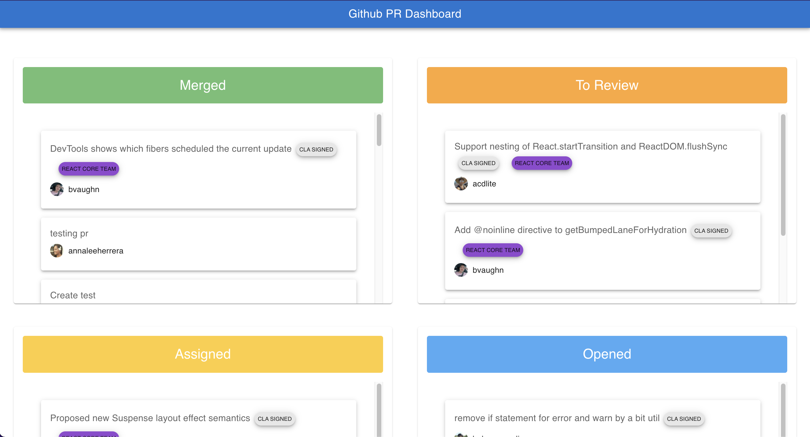

# Samples built on Canonic

This repository contains code samples for different types of applications using different languages and frameworks. 
**The applications are powered by APIs built using [Canonic's](https://canonic.dev) platform.**

## Projects

### 🍿 [Movie Hunt](./moviehunt-web/)

Similar to Product Hunt but for movies. It's a dynamic web application based on Gatsby

---

 

### 🍻 [Canolo](./Canolo-iOS/)

Sample iOS Application built with Swift for getting a party started.

---

 

### 🔐 [Google Signin with React using Graphql](./google-signin-with-react/)

Sample web app built using React, demonstrating how google signin works with Canonic via graphql APIs

---

 

### 🃏 [React Webapp for pointing poker](./sprint-poker/)

ReactJS webpack integrated with Canonic using APIs for pointing poker to help you decide story points to JIRA tickets

---

 

### [Kanban Board a react app](./kanban-board/)

Sample kanban board web app created using React,apollo and graphql.

---

 

### [Roadmap](./roadmap/)

Roadmap app created with React, GraphQL and Canonic as a backend.

---

 

### [🚨 Dynamic website popups](./dynamic-website-popups/)

A demo showcasing how dynamic notifications can be built on React and powered by [Canonic](https://canonic.dev/) as the **Backend**.

---

 

### [Release Notes](./release-notes-app/)

A React js project using Tailwind CSS and Canonic.

---

 

### [Forms](./canonic-forms/)

Simple web forms for **Contact us** and **Get a Demo** build with React and Ant Design, powered by by [Canonic](https://canonic.dev/) as the **Backend**..

---

 

### [Github PR Dashboard](./github-pr-dashboard/)

A dashboard for **Github Pull Requests** build with React and Material UI, powered by by [Canonic](https://canonic.dev/) as the **Backend**..

---

 

### [Postgres Dashboard](./postgres-dashboard/)

A dashboard built on top of PostgresSQL database, powered by Canonic.

---

 

### [Customer Dashboard](./customer-information/)

A simple mobile responsive dashboard dislaying data from **Stripe** & **Hubspot**. Frontend is built using `React` and `Bootstrap` Frameworks and powered by [Canonic](https://canonic.dev/) as the Backend.

---

 

#### More coming soon 🚀

#### Join the thriving 🌎 [Discord](https://discord.gg/9dyytsM) community to get help and share and brainstorm ideas.
