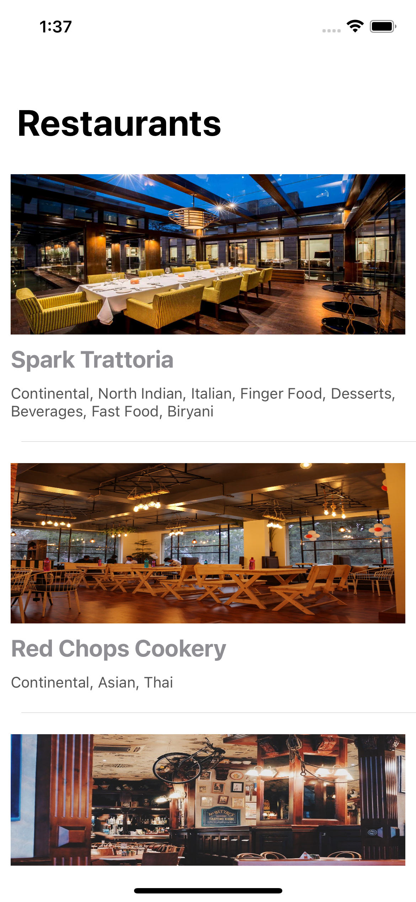
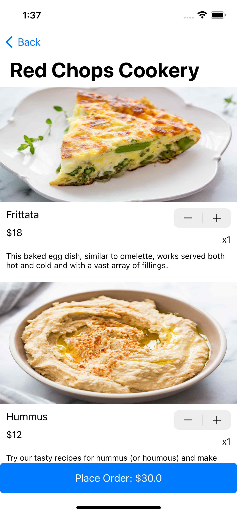
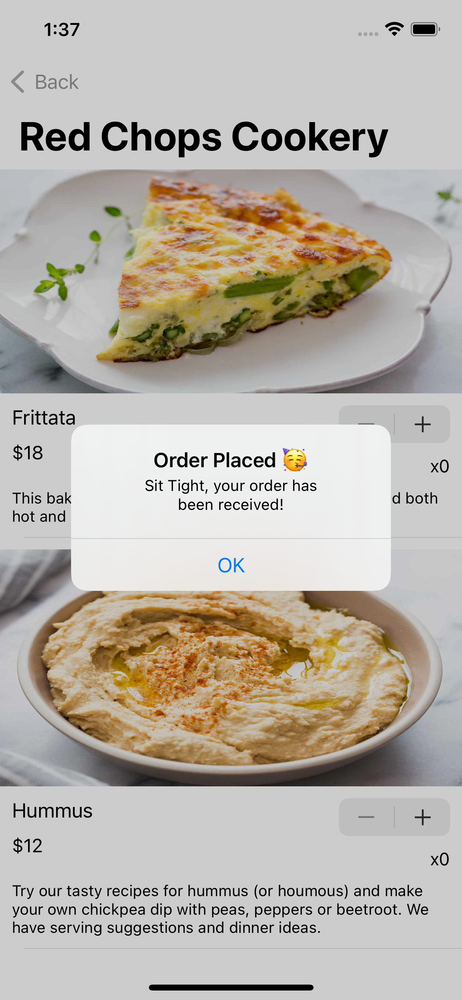

# Restaurant App

A basic Food Ordering iOS Application built with Swift 5 and Canonic as the backend.

It shows the list of all the restaurants on the Home View Controller.

When you tap on any of the restaurants, it fetchs the menu items for it from the backend and shows.

You can add your items from here and place your order.

A sample app powered by [Canonic](https://canonic.dev/)

 

### Step-by-step guide to making this project

You can find the step-by-step for making this project [here]()

### Connecting with your backend

To connect this application, to your backend server, you can find the sample backend project [**Restaurant App**](https://app.canonic.dev/projects/61cbfe5f44191100269f5f38/graph) [here](https://app.canonic.dev/dashboard/marketplace/samples) and clone it.
