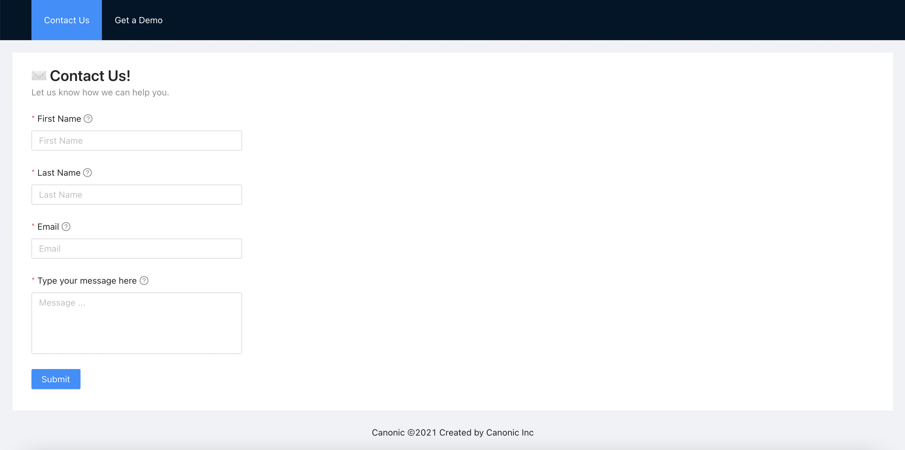
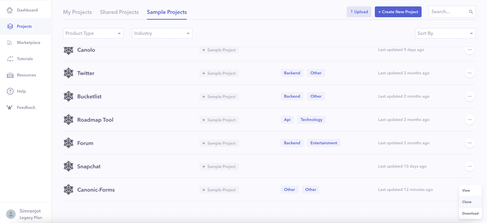
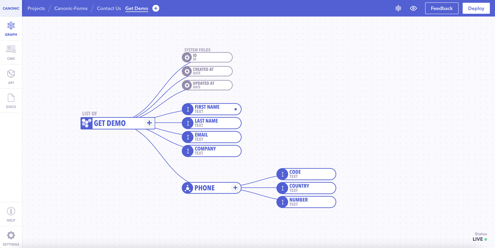
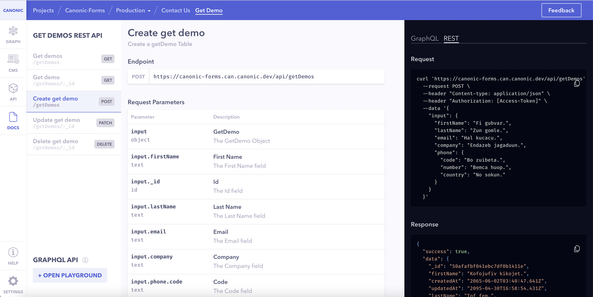
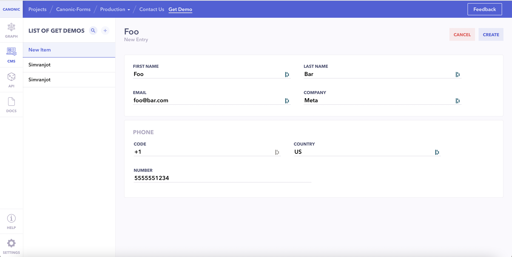

# Canonic Forms

A simple mobile responsive implementation of forms using `React` and `Ant Design` as Frontend Frameworks and powered by [Canonic](https://canonic.dev/) as a **Backend**.

The web-app looks like this:

[**Live Demo**](https://canonic-forms.netlify.app)

[**Guide**](https://dev.to/canonic/build-request-forms-using-react-ant-design-and-a-lowcode-backend-26oe)

The app follows a tabbed layout, each tab representing a separate form. One you fill out the required details, on submit it'll make a `POST` request to the canonic's sample project and sumit your details.

### `yarn start`

Runs the app in the development mode.\
Open [http://localhost:3000](http://localhost:3000) to view it in the browser.

## Components

---

### Contact Form

It is a self contained form that let's user submit their contact information to your backend project. It first validates fields, shows up errors if any, takes the filled values and creates an entry in the backend. It uses the `useContactUs` util component which contains the code to make an API call to the backend.

### Get a Demo

It is a self contained form that let's user submit their contact information for your platform demo purposes. It first validates fields, shows up errors if any, takes the filled values and creates an entry in the backend. It uses the `useGetDemo` util component which contains the code to make an API call to the backend.

## Backend

---

You can find the sample backend project **canonic-forms** [here](https://app.canonic.dev/dashboard/marketplace/samples) and clone it.

The data model (schema) is defined, just hit `Deploy` on the top-right and get all the APIs and it's documentation auto-generated.

### Connecting with your backend

Find the `useContactUs.js` and `useGetDemo.js` files under the `utils/apis` folder. Just replace the `url` parameter to point to your backend API URLs and you are good to go.

You'll see all of the entries created by the forms in the `CMS` Tab.

