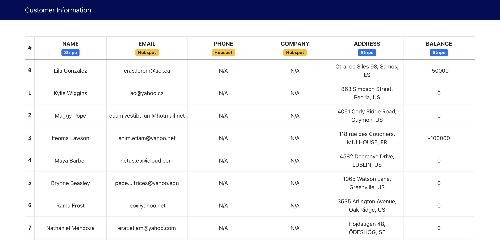
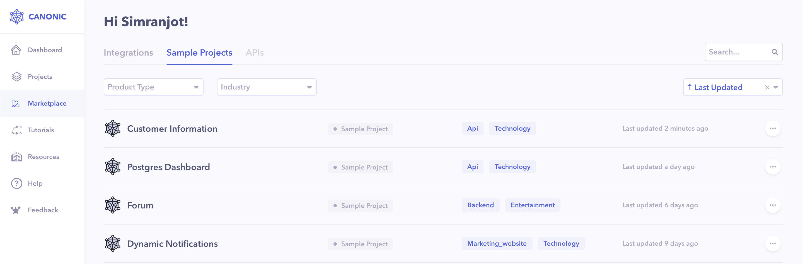

# Customer Dashboard (Stripe & Hubspot) with GraphQL

A simple mobile responsive dashboard dislaying data from Stripe & Hubspot. Frontend is built using `React` and `Bootstrap` Frameworks and powered by [Canonic](https://canonic.dev/) as a **Backend**.

The web-app looks like this:

[**Live Demo**]()

[**Guide**]()

The app follows a layout with a sticky `Header` at the top, `Table` in the middle, and a `Footer` at the bottom.

### `yarn start`

Runs the app in the development mode.\
Open [http://localhost:3000](http://localhost:3000) to view it in the browser.

## Components

---

### Information Table

It is a self contained component that fetches the information from the backend, normalises the data and displays within a `Table` Component. It shows a loading indicator when the API call is in progress.

## Backend

---

You can find the sample backend project **Customer Information** [here](https://app.canonic.dev/dashboard/marketplace/samples) and clone it.

