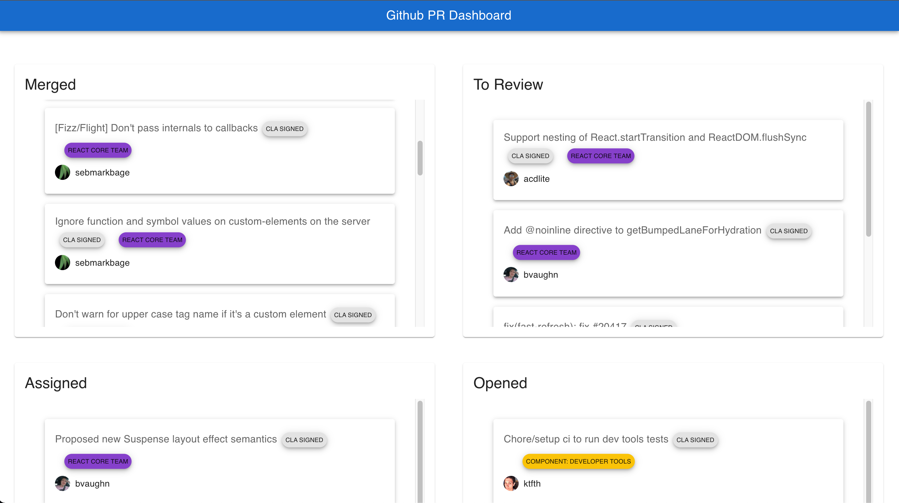
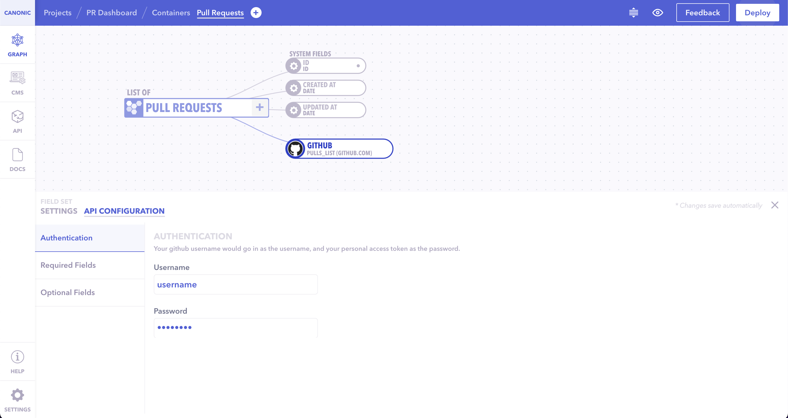
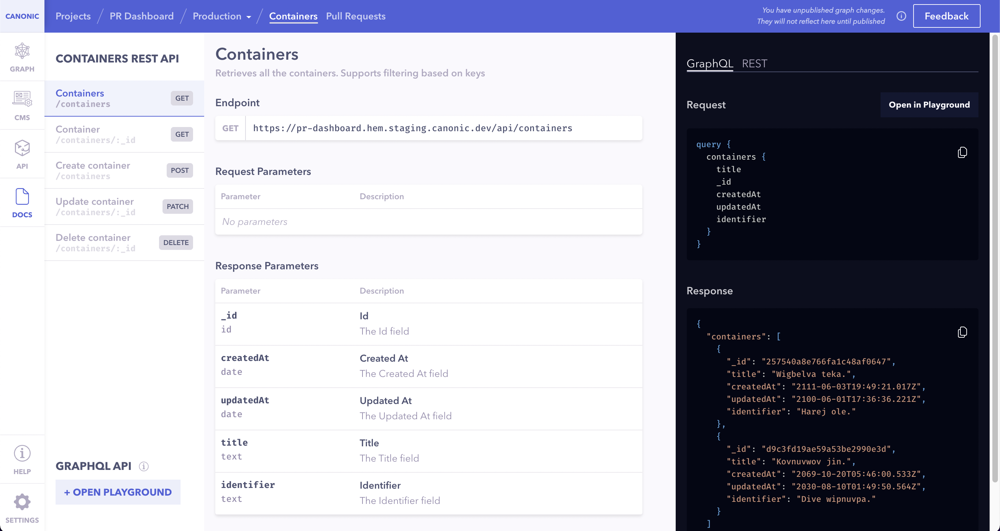

# Github PR Dashboard

The app is a demo of how you can build a Github PR Dashboard using React, graphql and [Canonic](https://canonic.dev/) as the **Backend**



**Pull requests details are fetched from your Canonic project.**

## Links

### [Demo](https://canonic-github-dashboard.netlify.app/)

### [Tutorial]()

## Running the example

### Frontend

The frontend is a simple create-react-app. After cloning, install the dependencies.

```
yarn install
```

Then start the dev server

```
yarn start
```

### Backend

You can find the sample backend project **Github PR Dashboard** [here](https://app.canonic.dev/projects/61b0eedde08af1002f135b04/graph) and clone it.



Copy the base url from the docs



Change the value of URI in [index.js](./src/index.js)

The example should now fetch data from the project you deployed.
