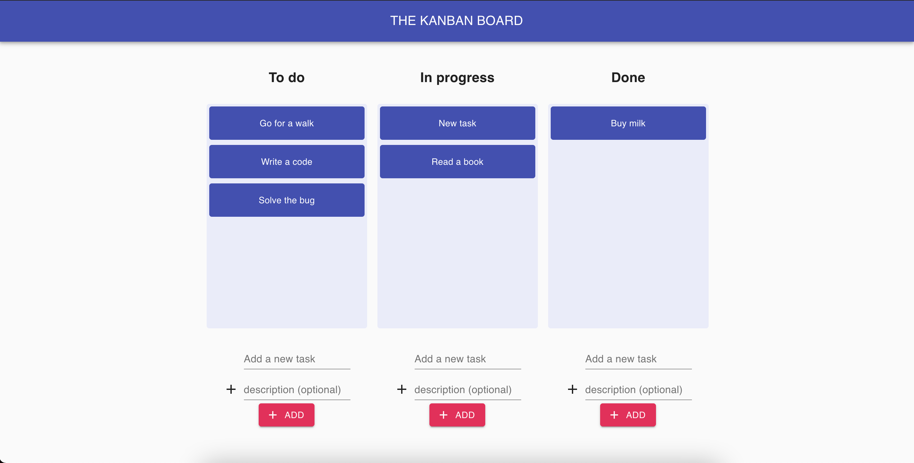

# The Kanban Board

A kanban board web application built using React.



A sample app powered by [Canonic](https://canonic.dev/)

[Link](https://kanban-canonic-backend.netlify.app/)
<br/>

### Developing

Starts the development server on port `8000`.
Tested on `nodeJS v12.20`

```
yarn install
yarn start
```

### Deploying

Generates production assets in the `public` folder.

```
yarn install
yarn build
```
