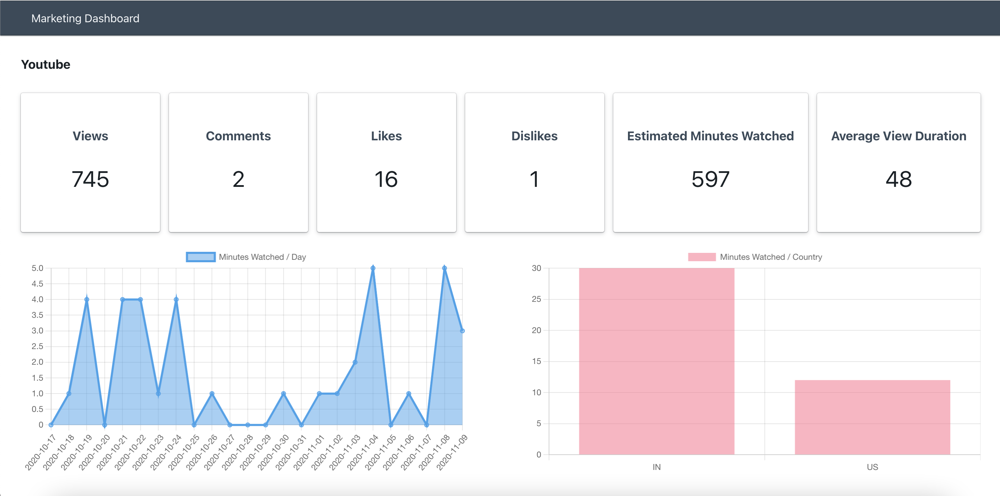
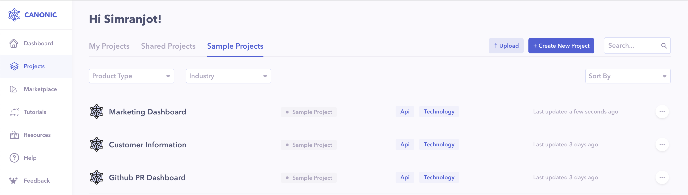

# Marketing Dashboard (Youtube & Twitter) with GraphQL

A simple dashboard dislaying metrics from your **Youtube** & **Twitter**. Frontend is built using `React`, `Blueprint` & `react-chartjs-2` Frameworks and powered by [Canonic](https://canonic.dev/) as a **Backend**.

The web-app looks like this:

[**Live Demo**](https://canonic-marketing-dashboard.netlify.app/)

[**Guide**](https://dev.to/canonic/how-to-build-a-twitter-youtube-analytics-dashboard-with-react-2p2d)

The app follows a layout with a sticky `Header` at the top, `Metrics` in the middle, and a `Footer` at the bottom. It shows a `loading indicator` when the API call is in progress.

### `yarn start`

Runs the app in the development mode.\
Open [http://localhost:3000](http://localhost:3000) to view it in the browser.

## Components

---

### Youtube Cards & Graphs

It is a self contained component that gets the youtube metrics from it's parent component, normalises the data and displays them as `Cards` & `Graphs`.

### Twitter Cards

It is a self contained component that gets the twitter metrics from it's parent component, normalises the data and displays them as `Cards`.

## Backend

---

You can find the sample backend project **Customer Information** [here](https://app.canonic.dev/dashboard/marketplace/samples) and clone it.

