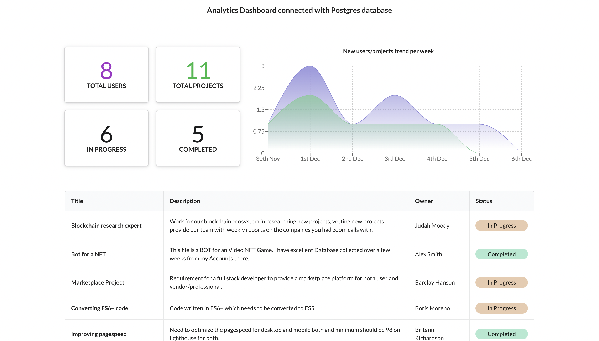

# Postgres Dashboard

A Dashboard built using React, Rest API and Canonic as the backend - connected to a PostgresSQL database.


A sample app powered by [Canonic](https://canonic.dev/?utm_source=github&utm_medium=organic_samples&utm_campaign=30daysofcanonic_uc_2&utm_term=canonic&utm_content=day_8)

[Link](https://canonic-postgres-dashboard.netlify.app/)
<br/>

### Step-by-step guide to making this project
You can find the step-by-step for making this project [here](https://dev.to/canonic/creating-a-dashboard-for-your-postgres-db-with-react-and-recharts-2ecm)

### Cloning the frontend

The frontend is a simple create-react-app. After cloning, install the dependencies.

```
yarn install
```

Then start the dev server

```
yarn start
```

### Connecting with your backend

To connect this application, to your backend server.

1. You can find the sample backend project **postgres dashboard** [here](https://app.canonic.dev/projects/61ae4ae2b122dd00278f1759/graph?utm_source=github&utm_medium=organic_samples&utm_campaign=30daysofcanonic_uc_2&utm_term=connect_with_backend_here&utm_content=day_8) and clone it.
2. Copy the url from the docs
3. Go to [DashboardGrid.js](./src/components/DashboardGrid/DashboardGrid.js) and [DashboardTable.js](./src/components/DashboardTable/DashboardTable.js) - change the uri to point to your project.
### Deploying

Generates production assets in the `public` folder.

```
yarn install
yarn build
```