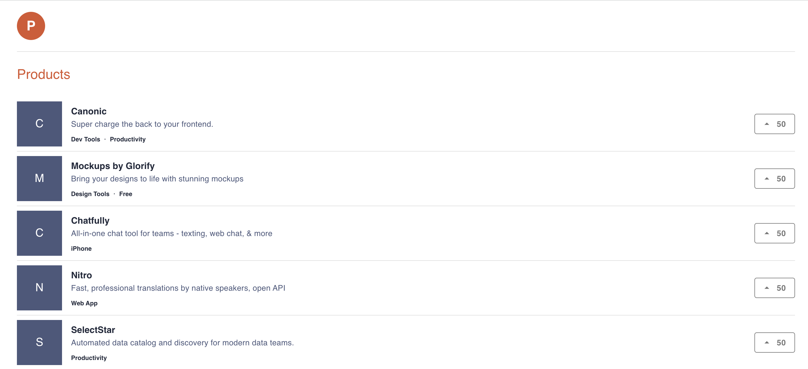

# Product Hunt

A basic clone application of Product Hunt built using React, MaterialUI and Canonic as the backend.



A sample app powered by [Canonic](https://canonic.dev/)

[Guide](https://dev.to/canonic/producthunt-clone-react-lowcode-backend-135)
[Demo](https://canonic-product-hunt.netlify.app)
<br/>

### Step-by-step guide to making this project

You can find the step-by-step for making this project [here]()

### Cloning the frontend

The frontend is a simple create-react-app. After cloning, install the dependencies.

```
yarn install
```

Then start the dev server

```
yarn start
```

### Connecting with your backend

To connect this application, to your backend server, you can find the sample backend project **Product Hunt** [here](https://app.canonic.dev/dashboard/marketplace/samples) and clone it.

### Deploying

Generates production assets in the `public` folder.

```
yarn install
yarn build
```
