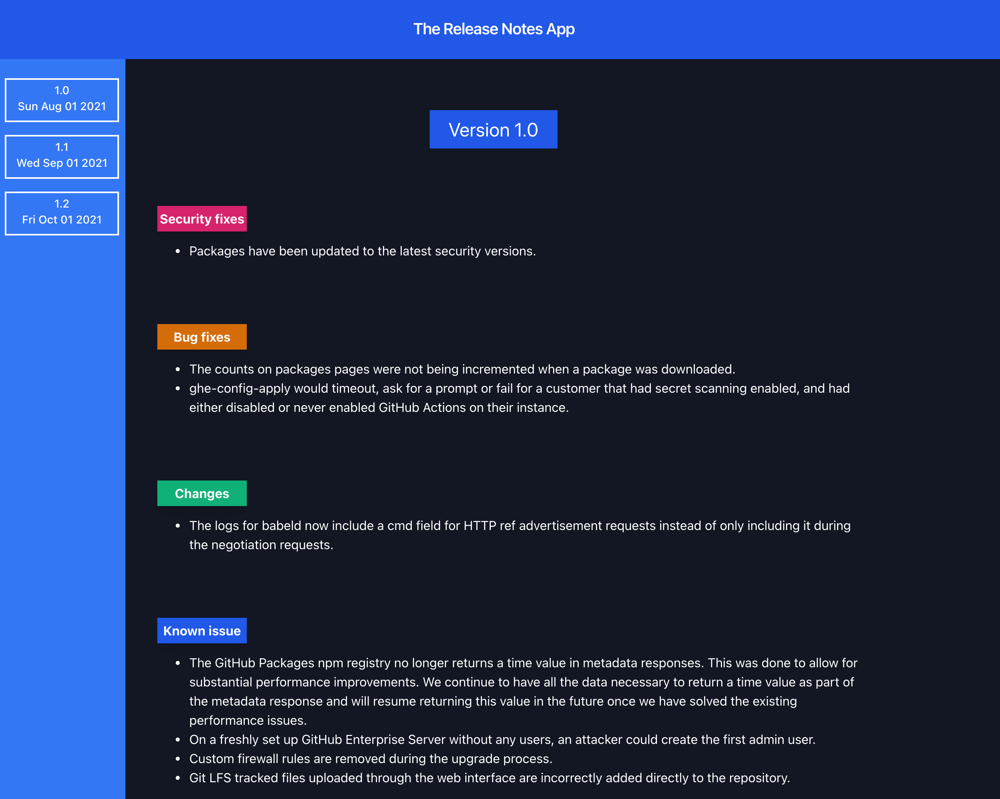

# Release Notes App

The app is built using React, Tailwind, Graphql and Canonic. It displays the release notes along with their label tag.



A sample app powered by [Canonic](https://canonic.dev/)

[Live Demo](https://eloquent-brown-404f49.netlify.app/)
<br/>

### Connecting with your backend

To connect this application, to your backend server.
Go to [App.js](./src/App.js) and change the uri in the apollo client
to point to your backend.

### Other Sample projects

[Canonic Sample Projects](https://github.com/canonic-dev/canonic-samples)

### 30 Days of Canonic

[Visit](http://www.canonic.dev/30-days-of-canonic)

### Developing

Starts the development server on port `3000`.
Tested on `nodeJS v15.14.0`

```
yarn install
yarn start
```

### Deploying

Generates production assets in the `public` folder.

```
yarn install
yarn build
```
