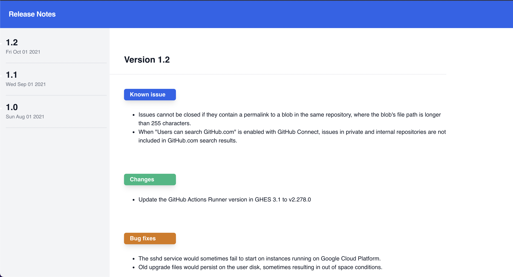

# Release Notes App

The app is a demo of how you can build a Release notes app using React, graphql and [Canonic](https://canonic.dev/) as the **Backend**



**Contents for you release notes like version number and description is fetched from your Canonic project.**

## Links

### [Demo](https://canonic-release-notes.netlify.app)

### [Tutorial](https://dev.to/canonic/publish-changelog-for-your-product-using-react-and-tailwind-nmn)

## Running the example

### Frontend

The frontend is a simple create-react-app. After cloning, install the dependencies.

```
yarn install
```

Then start the dev server

```
yarn start
```

### Backend

You can find the sample backend project **Release Notes App** [here](https://app.canonic.dev/dashboard/marketplace/samples) and clone it.


Copy the base url from the docs


Change the value of URI in [App.js](./src/App.js)

The example should now fetch data from the project you deployed.
