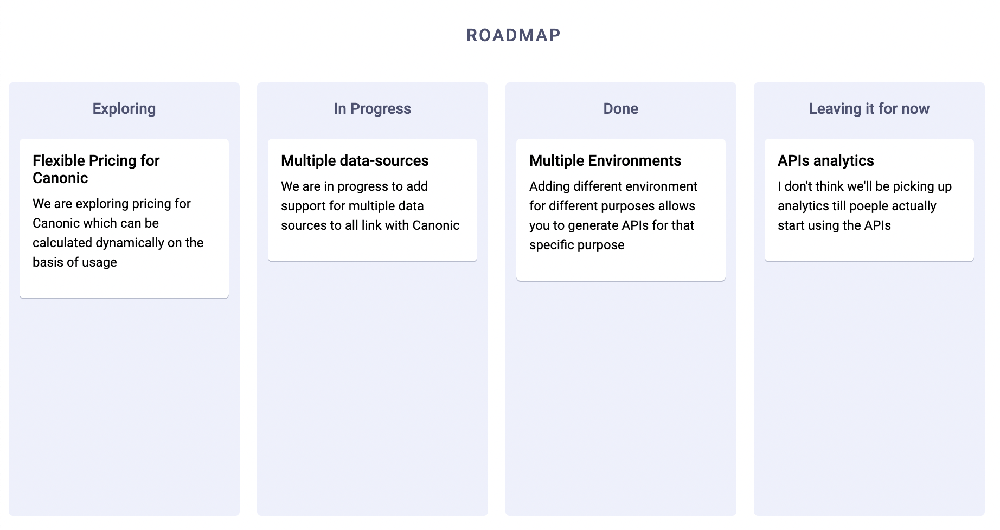

# Roadmap

A Roadmap application built using React, Graphql and Canonic as the backend.


A sample app powered by [Canonic](https://canonic.dev/)

[Link]()
<br/>

### Connecting with your backend
To connect this application, to your backend server.
Go to [App.js](./src/App.js) and change the uri in the apollo client
to point to your backend.

### Developing

Starts the development server on port `3000`.
Tested on `nodeJS v12.20`

```
yarn install
yarn start
```

### Deploying

Generates production assets in the `public` folder.

```
yarn install
yarn build
```
